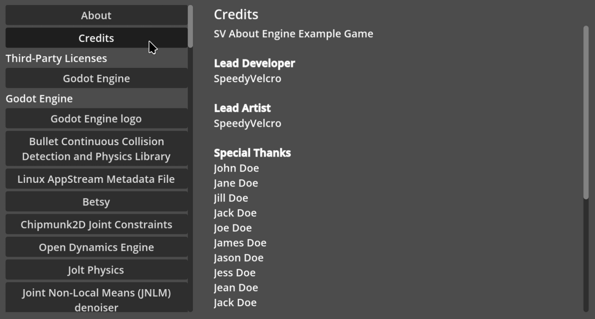

# SV About Menu
About menu UI for displaying licenses and other info in Godot Engine
games.

## Features
- Configure and display custom about menu sections.
- Quickly and easily display the Godot Engine license.
- Automatically display all of the licenses for the Godot Engine's
  third-party components by toggling a single exported variable.

## Prerequisites
- Godot 4.6

## Usage
- Copy the `addons/sv_about_menu` folder into the `addons` folder of
  your Godot game. There is no need to activate any plugin.
- New nodes will be available to add to any scene tree through the
  usual interface. They are prefixed with `SVAbout`.
- Add the following nodes to any scene:
  - `SVAboutMenuUIController`
  - `SVAboutButtonsSelector`
  - `SVAboutSelectedTitleLabel` (optional, you don't necessarily need
    to display the title if your entry descriptions are already going
    to include them)
  - One of the following:
    - `SVAboutSelectedDescriptionLabel` (recommended)
    - `SVAboutSelectedDescriptionTextEdit`
- Set the UI controller on all nodes that have the `ui_controller`
  exported property.
- Create a new `SVAboutGameInfo` on the "Game Info" exported property
  of `SVAboutMenuUIController`, and configure it to display the entries
  you need.

You should now have a functioning about menu in your scene. For an
example of a fully-configured about menu, see the example project in
the root of the repository.

## License
See [`LICENSE.txt`](LICENSE.txt)
